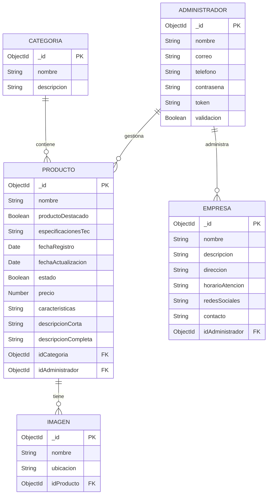

# Diagrama Entidad-Relación (ER) - Electrónova

A continuación se muestra el modelo de datos utilizado por la aplicación (implementado en MongoDB con Mongoose).

## Entidades Principales

- **Administrador**: Usuarios con acceso al panel de administración.
- **Categoria**: Clasificación de los productos.
- **Producto**: Información detallada de los artículos en venta.
- **Imagen**: Referencias a las imágenes subidas de los productos.
- **Empresa**: Información estática o de configuración del sitio.

## Relaciones

- Una **Categoria** puede tener múltiples **Productos** (`1:N`).
- Un **Administrador** puede gestionar (registrar) múltiples **Productos** (`1:N`).
- Un **Producto** puede tener múltiples **Imágenes** (`1:N`).
